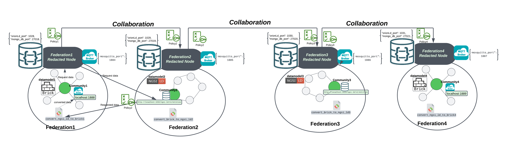

# CCduit Software Overlay Prototype

This README provides comprehensive instructions for setting up and using the 'CCduit' Software Overlay prototype, 
first described at ICSA 2024 and subsequently implemented and submitted as an artifact for SEAMS 2025 (Adaptive and Interoperable Federated Data Spaces: An Implementation Experience). The software allows data space federations to collaborate dynamically, exchange context, and manage interactions effectively. The instructions cover the configuration of multiple federations, communities, data models, functions, and policies, along with steps to run the services required by the tool, how to 'play' with a simple example of a possible interaction, and details to recreate experiments from the paper.

---

**Repository Description**

This repository serves as the comprehensive source for the CCDUIT project and is organized into **four primary directories.** The `CCDUIT Software` folder contains the **core source code** of the software overlay, while the `Communities` folder is subdivided into four separate folders—each belonging to a distinct federation—to facilitate community setup for experimental and demo purposes. The `Examples/Simple_Interaction` directory includes a demo illustrating the process of initiating a basic interaction between two communities using **CCDUIT**. Finally, the `Experiments` folder compiles all experimental setups necessary to reproduce the performance evaluations and adaptation experiments.

---

## Table of Contents

- [CCduit Software Overlay Prototype](#redacted-software-overlay-prototype)
  - [Table of Contents](#table-of-contents)
  - [Prerequisites](#prerequisites)
  - [](#)
  - [Installation and Configuration](#installation-and-configuration)
    - [Step 1: Download the Source Code](#step-1-download-the-source-code)
    - [Step 2: Run the Application](#step-2-run-the-application)
    - [Example Configuration for Each Federation](#example-configuration-for-each-federation)
      - [Federation 1](#federation-1)
      - [Federation 2](#federation-2)
      - [Federation 3](#federation-3)
      - [Federation 4](#federation-4)
    - [Step 3: Start the Containers](#step-3-start-the-containers)
    - [Step 4: Run the Monitoring Services](#step-4-run-the-monitoring-services)
    - [Step 5: Context Registration for Each Federation](#step-5-context-registration-for-each-federation)
      - [Federation 1](#federation-1-1)
      - [Federation 2](#federation-2-1)
      - [Federation 3](#federation-3-1)
      - [Federation 4](#federation-4-1)
    - [Step 6: Policy Registration for Each Federation](#step-6-policy-registration-for-each-federation)
      - [Federation 1](#federation-1-2)
      - [Federation 2](#federation-2-2)
      - [Federation 3](#federation-3-2)
      - [Federation 4](#federation-4-2)
    - [Step 7: Collaboration Initiation Between Federations](#step-7-collaboration-initiation-between-federations)
      - [Federation 1 → Federation 2](#federation-1--federation-2)
      - [Federation 2 → Federation 3](#federation-2--federation-3)
      - [Federation 3 → Federation 4](#federation-3--federation-4)
    - [Step 8: Manual Context Exchange (Fallback)](#step-8-manual-context-exchange-fallback)
  - [Testing Data Interaction Between Communities](#testing-data-interaction-between-communities)
    - [Step 1: Set Up Community2 Endpoint](#step-1-set-up-community2-endpoint)
    - [Step 2: Set Up Community1 Endpoint](#step-2-set-up-community1-endpoint)
    - [Step 3: Create Data Interaction](#step-3-create-data-interaction)
---

## Prerequisites

- **Operating System:**  
  - Tested on **Windows 11** and **Ubuntu 22.04.4 LTS**.  
  - The instructions should work on any system supporting Python and Docker.

Ensure the following are installed on your system:

- **Python 3:**  
  Verify the installation by running:

  ```bash
  python3 --version
  ```

- **Docker Engine:**  
  Install Docker Desktop for Windows or Docker Engine for Linux.  
  Ensure Docker is running:

  ```bash
  docker --version
  ```

**Note:** The instructions contain details to create a **federation of federations** using **four example federations** like in the figure below. All context and details have been simplified for easier understanding and experimentation. All commands (e.g., registrations, interactions) should be executed via the API (`app.py`) of the relevant federation.


---

## Installation and Configuration

### Step 1: Download the Source Code

1. Download the provided source code archive.
2. Extract the archive into **separate directories**, each corresponding to one **'CCduit' node** for each federation described below.  
   **Important:** Extract each node from the original archive to avoid conflicts caused by duplication.
3. Install the required packages:

   ```bash
   pip install -r requirements.txt
   ```

---

### Step 2: Run the Application

1. **Open a terminal** in the directory of the **'CCduit' node** you wish to configure.

2. **Modify the `app.py` Port:**  
   Each federation node should run on a **unique port** to avoid conflicts.

   - Open the `app.py` file in a text editor.
   - Locate the line defining the port (e.g., `Api_port = 5000`).
   - Change the port number for each federation. For example:

     ```python
     Api_port = 5001  # Federation 1
     Api_port = 5002  # Federation 2
     Api_port = 5003  # Federation 3
     Api_port = 5004  # Federation 4
     ```

3. **Run the application for each federation:**

   ```bash
   python3 app.py
   ```

4. **Access the API documentation** in your browser by visiting:
    http://127.0.0.1:<Api_port>/docs


5. **Configure the software** via the API’s **Configuration** section to assign unique ports and names to each Docker container.

---

### Example Configuration for Each Federation

#### Federation 1

```json
{
"federation_name": "Federation1",
"orionLd_port": 1028,
"mongo_db_port": 27018,
"mosquitto_port": 1884
}
```

#### Federation 2

```json
{
"federation_name": "Federation2",
"orionLd_port": 1029,
"mongo_db_port": 27019,
"mosquitto_port": 1885
}
```

#### Federation 3

```json
{
"federation_name": "Federation3",
"orionLd_port": 1030,
"mongo_db_port": 27020,
"mosquitto_port": 1886
}
```

#### Federation 4

```json
{
"federation_name": "Federation4",
"orionLd_port": 1031,
"mongo_db_port": 27021,
"mosquitto_port": 1887
}
```


---

### Step 3: Start the Containers

1. **Navigate to the `brokers` folder** of each federation:

   ```bash
   cd brokers
   ```

2. **Start the Docker containers**:

   ```bash
   docker-compose up
   ```

3. To run the containers in **detached mode** (background), use:

   ```bash
   docker-compose up -d
   ```

---

### Step 4: Run the Monitoring Services

1. Access the **Run Monitoring Services** section in the API documentation for each federation node.

2. **Execute the Run Monitoring** function to start monitoring services.

3. **Verify** that all monitoring processes are active and running as expected, you will see on the terminal two messages :
- Hello, Policy Synchronizer!
- Hello, collaboration monitoring!

---

### Step 5: Context Registration for Each Federation

Each federation node requires context registration to manage federations, communities, data models, and functions.

**Note:** The following instructions will create context for **four federations** with simplified configurations to facilitate understanding and experimentation. 
Make sure to follow the exact order [Federation, Data Model, Community, Function etc.] because there are bidirectional relationships created automatically by the system that assume that this order has been followed.

#### Federation 1

**Register Federation:**

```json
{
  "federation_Id": "Federation1",
  "name": "Federation1",
  "topology": "star",
  "structure": "hierarchy",
  "areaCovered": "5000m2",
  "number_Of_Nodes": 1,
  "includes_Communities": [],
  "uses_Interactions": []
}
```

**Register Data Model:**

```json
{
  "dataModel_Id": "datamodel1",
  "name": "Brick Ontology",
  "description": "A metadata schema designed for buildings.",
  "format": "TTL",
  "specific_Ontology": "Brick",
  "ontology_Version": "1.3",
  "ontology_URL": "https://brickschema.org/ontology/1.3/Brick.ttl"
}
```

**Register Community:**

```json
{
  "community_Id": "Community1",
  "name": "Community1",
  "connection_Details": {
    "endpoint": "localhost:1888",
    "protocol": "MQTT"
  },
  "origin": "France",
  "role_In_Federation": "Occupancy Data Provider",
  "has_Data_Models": ["datamodel1"],
  "part_Of_Federation": "Federation1",
  "geographical_Location": ""
}
```

**Register Function:**

```json
{
  "function_Id": "convert_ngsi_ld_to_brick1",
  "call_Function": "convert_ngsi_ld_to_brick",
  "description": "Converts NGSI-LD data model to Brick.",
  "From_model": "NGSI-LD",
  "To_model": "Brick",
  "Version": "1.0",
  "usage_Guide": "Accepts JSON input, outputs TTL format.",
  "packages": ["rdflib", "datetime", "json"]
}
```

---

#### Federation 2

**Register Federation:**

```json
{
  "federation_Id": "Federation2",
  "name": "Federation2",
  "topology": "ring",
  "structure": "hierarchical",
  "areaCovered": "6000m2",
  "number_Of_Nodes": 1,
  "includes_Communities": [],
  "uses_Interactions": []
}
```

**Register Data Model:**

```json
{
  "dataModel_Id": "datamodel2",
  "name": "NGSI-LD",
  "description": "A metadata schema for weather observations, facilitating semantic interoperability.",
  "format": "JSON",
  "specific_Ontology": "https://schema.org/Weather",
  "ontology_Version": "1.0",
  "ontology_URL": "https://schema.org/docs/weather.html"
}
```

**Register Community:**

```json
{
  "community_Id": "Community2",
  "name": "Community2",
  "connection_Details": {
    "endpoint": "http://localhost:1032/ngsi-ld/v1/entities",
    "protocol": "HTTP"
  },
  "origin": "France",
  "role_In_Federation": "Weather Data Provider",
  "has_Data_Models": ["datamodel2"],
  "part_Of_Federation": "Federation2",
  "geographical_Location": ""
}
```

**Register Function:**

```json
{
  "function_Id": "convert_brick_to_ngsi_ld2",
  "call_Function": "convert_brick_to_ngsi_ld",
  "description": "This function converts Brick data into NGSI-LD format.",
  "From_model": "Brick",
  "To_model": "NGSI-LD",
  "Version": "1.0",
  "usage_Guide": "Accepts TTL input, outputs JSON format.",
  "packages": ["rdflib", "datetime", "json"]
}
```

---

#### Federation 3

**Register Federation:**

```json
{
  "federation_Id": "Federation3",
  "name": "Federation3",
  "topology": "ring",
  "structure": "hierarchical",
  "areaCovered": "6000m2",
  "number_Of_Nodes": 1,
  "includes_Communities": [],
  "uses_Interactions": []
}
```

**Register Data Model:**

```json
{
  "dataModel_Id": "datamodel3",
  "name": "NGSI-LD",
  "description": "A metadata schema for weather observations, facilitating semantic interoperability.",
  "format": "JSON",
  "specific_Ontology": "https://schema.org/Weather",
  "ontology_Version": "1.0",
  "ontology_URL": "https://schema.org/docs/weather.html"
}
```

**Register Community:**

```json
{
  "community_Id": "Community3",
  "name": "Community3",
  "connection_Details": {
    "endpoint": "http://localhost:1033/ngsi-ld/v1/entities",
    "protocol": "HTTP"
  },
  "origin": "France",
  "role_In_Federation": "Weather Data Provider",
  "has_Data_Models": ["datamodel3"],
  "part_Of_Federation": "Federation3",
  "geographical_Location": ""
}
```

**Register Function:**

```json
{
  "function_Id": "convert_brick_to_ngsi_ld3",
  "call_Function": "convert_brick_to_ngsi_ld",
  "description": "This function converts Brick data into NGSI-LD format.",
  "From_model": "Brick",
  "To_model": "NGSI-LD",
  "Version": "1.0",
  "usage_Guide": "Accepts TTL input, outputs JSON format.",
  "packages": ["rdflib", "datetime", "json"]
}
```

---

#### Federation 4

**Register Federation:**

```json
{
  "federation_Id": "Federation4",
  "name": "Federation4",
  "topology": "star",
  "structure": "hierarchy",
  "areaCovered": "7000m2",
  "number_Of_Nodes": 1,
  "includes_Communities": [],
  "uses_Interactions": []
}
```

**Register Data Model:**

```json
{
  "dataModel_Id": "datamodel4",
  "name": "Brick Ontology",
  "description": "A metadata schema designed for buildings, facilitating semantic interoperability for building management systems.",
  "format": "TTL",
  "specific_Ontology": "Brick",
  "ontology_Version": "1.3",
  "ontology_URL": "https://brickschema.org/ontology/1.3/Brick.ttl"
}
```

**Register Community:**

```json
{
  "community_Id": "Community4",
  "name": "Community4",
  "connection_Details": {
    "endpoint": "localhost:1889",
    "protocol": "MQTT"
  },
  "origin": "France",
  "role_In_Federation": "Occupancy Data Provider",
  "has_Data_Models": ["datamodel4"],
  "part_Of_Federation": "Federation4",
  "geographical_Location": ""
}
```

**Register Function:**

```json
{
  "function_Id": "convert_ngsi_ld_to_brick4",
  "call_Function": "convert_ngsi_ld_to_brick",
  "description": "This function converts NGSI-LD data model to Brick.",
  "From_model": "NGSI-LD",
  "To_model": "Brick",
  "Version": "1.0",
  "usage_Guide": "Accepts JSON input, outputs TTL format.",
  "packages": ["rdflib", "datetime", "json"]
}
```

---
---

### Step 6: Policy Registration for Each Federation

Each federation requires policies to control the sharing and forwarding of data. The following policies allow federations to share data publicly or with specific federations. These policies should be registered using the **Create Publish Policy** endpoint in the **Policy Management** section of each federation's API.

#### Federation 1

**Register Policy:**

```json
{
  "policy_ID": "Policy1",
  "name": "Policy1",
  "description": "This policy allows sharing and forwarding data publicly.",
  "permittedContextTypes": ["community", "federation", "policies", "functions", "datamodels"],
  "sharingRules": [
    {"federation": "Federation2", "canReceive": true, "canForward": true},
    {"federation": "public", "canReceive": true, "canForward": true}
  ],
  "modifiedBy": "",
  "Geographic_Restrictions": []
}
```

#### Federation 2

**Register Policy:**

```json
{
  "policy_ID": "Policy2",
  "name": "Policy2",
  "description": "This policy allows sharing and forwarding data publicly.",
  "permittedContextTypes": ["community", "federation", "policies", "functions", "datamodels"],
  "sharingRules": [
    {"federation": "public", "canReceive": true, "canForward": true}
  ],
  "modifiedBy": "",
  "Geographic_Restrictions": []
}
```

#### Federation 3

**Register Policy:**

```json
{
  "policy_ID": "Policy3",
  "name": "Policy3",
  "description": "This policy allows sharing and forwarding data publicly.",
  "permittedContextTypes": ["community", "federation", "policies", "functions", "datamodels"],
  "sharingRules": [
    {"federation": "public", "canReceive": true, "canForward": true}
  ],
  "modifiedBy": "",
  "Geographic_Restrictions": []
}
```

#### Federation 4

**Register Policy:**

```json
{
  "policy_ID": "Policy4",
  "name": "Policy4",
  "description": "This policy allows sharing and forwarding data publicly.",
  "permittedContextTypes": ["community", "federation", "policies", "functions", "datamodels"],
  "sharingRules": [
    {"federation": "public", "canReceive": true, "canForward": true}
  ],
  "modifiedBy": "",
  "Geographic_Restrictions": []
}
```

---

### Step 7: Collaboration Initiation Between Federations

Collaboration initiation allows federations to exchange data and context. The following instructions outline how to initiate collaboration requests between federations using the **Initiate Collaboration** endpoint in the API documentation.

#### Federation 1 → Federation 2

**Request Body:**

```json
{
  "destination_broker": "localhost",
  "destination_port": 1885,
  "receiver_Fed_ID": "Federation2",
  "details": "Federation1 sends Collaboration Request to Federation2",
  "policy_ID": "Policy1"
}
```

#### Federation 2 → Federation 3

**Request Body:**

```json
{
  "destination_broker": "localhost",
  "destination_port": 1886,
  "receiver_Fed_ID": "Federation3",
  "details": "Federation2 sends Collaboration Request to Federation3",
  "policy_ID": "Policy2"
}
```

#### Federation 3 → Federation 4

**Request Body:**

```json
{
  "destination_broker": "localhost",
  "destination_port": 1887,
  "receiver_Fed_ID": "Federation4",
  "details": "Federation3 sends Collaboration Request to Federation4",
  "policy_ID": "Policy3"
}
```

---

### Step 8: Manual Context Exchange (Fallback)

Due to a recent critical bug, a **manual context exchange** is required for interactions to work correctly. Follow these steps to perform the manual context exchange:

1. In **Federation 1's `app.py`**, use the **Context Exchange After Collaboration** endpoint.

2. Specify **"Federation2"** as the target for context exchange and run the endpoint.

This will initiate a context exchange between **Federation 1** and **Federation 2** using the target federation's ID. The exchange respects the data exchange policy, so if the policy does not allow it, the exchange will fail.

For the rest (to make sure you can "play" with a fully connected network of federations):

1. In Federation 1's app.py, use the Context Exchange After Collaboration endpoint with "Federation2" as the target.

2. In Federation 2's app.py, run the endpoint with "Federation1" as the target, then run it again with "Federation3" as the target.

3. In Federation 3's app.py, run the endpoint with "Federation2" as the target, then run it again with "Federation4" as the target.

4. In Federation 4's app.py, run the endpoint with "Federation3" as the target
---

## Testing Data Interaction Between Communities

This section describes how **Community1** in **Federation 1** can interact with **Community2** in **Federation 2** to get occupancy data and convert it from the **NGSI-LD** data model to the **Brick** data model.

### Step 1: Set Up Community2 Endpoint

1. **Open a terminal** and navigate to the `community2_endpoint` folder:

   ```bash
   cd Examples/Simple_Interaction/community2_endpoint
   ```

2. **Start the Docker container:**

   ```bash
   docker-compose up -d
   ```

3. **Run the script** to upload synthetic occupancy observations:

   ```bash
   python3 community2_Occupancy.py
   ```

   This uploads synthetic occupancy data in **JSON format** to the broker.

### Step 2: Set Up Community1 Endpoint

1. **Open another terminal** and navigate to the `community1_endpoint` folder:

   ```bash
   cd Examples/Simple_Interaction/community1_endpoint
   ```

2. **Start the Docker container:**

   ```bash
   docker-compose up -d
   ```

3. **Verify the data** in **TTL format** by running:

   ```bash
   python3 verify.py
   ```

### Step 3: Create Data Interaction

1. Ensure that **Federation 1's `app.py`** is running.

2. Go to the **Data Interaction Management** section in the API and use the **Create Interaction** endpoint with the following request body:

   ```json
   {
     "initiated_By": "Federation1",
     "from_community": "Community2",
     "towards": "Community1",
     "Interaction_Type": "community",
     "Interaction_Status": "active",
     "source_data_model": "NGSI-LD",
     "target_data_model": "Brick",
     "sourcepath": "/?type=OccupancyReading",
     "destpath": "community2/occupancy"
   }
   ```

   This interaction converts the occupancy data from **NGSI-LD (JSON)** to **Brick (TTL)** and stores it in **Community1's endpoint**.
   You should be able to see the interaction happening in the terminal windows of each community that you have opened.

---

> [!NOTE]
>**_To reproduce all the experiments, please follow the guidelines [here](https://github.com/satrai-lab/ccduit/tree/completed_CCDUIT/Experiments)._**


